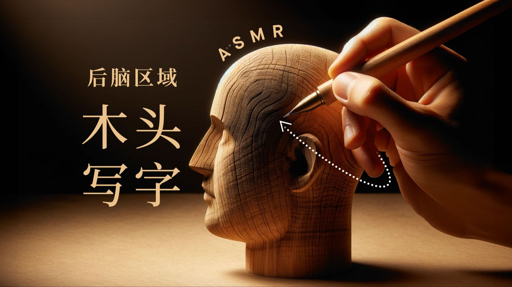
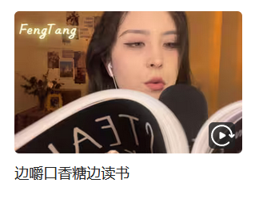
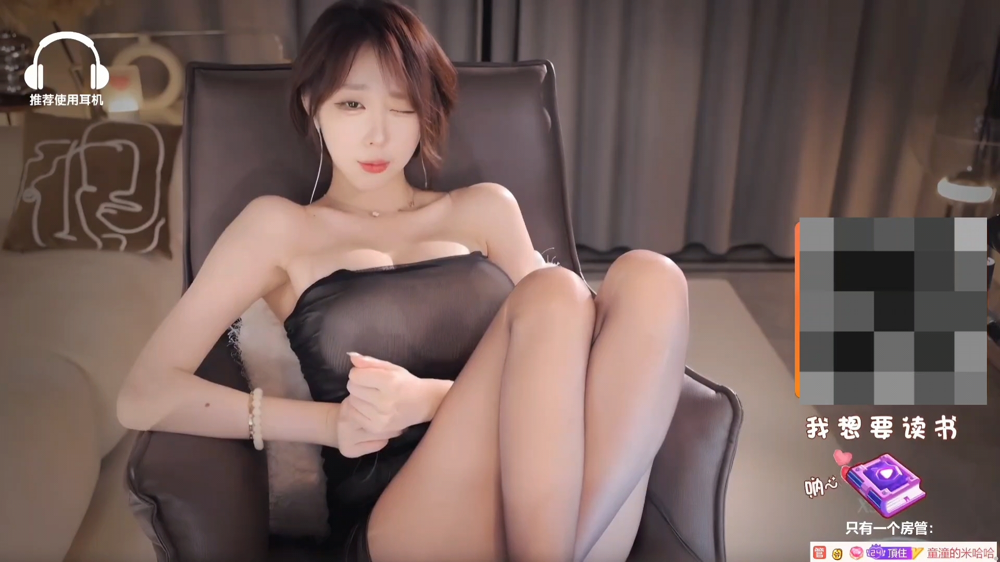

# 介绍动机

# 背景

自己想想，似乎听 ASMR 入睡已经维持了大概有四年左右了吧。

顾名思义，或者说道听途说，大家或多或少都又听到 ASMR 主要目的是为了助眠、放松。

但针对于「助眠、放松」，可能大部分人又和另外一种声音形式混淆，即「白噪音」。

但两者个人理解是截然不同，「白噪音」的体现形式更多是以自然的声音为题材，如海水、篝火、森林……所发出的声响来进行放松。

而「ASMR」的体现形式是通过博主的一些触发音*（可以是物件的，也可以是人声轻语）*来造成声响，起到一定的助眠作用。

简单列张表格，主要为以下形式——

|        | 形式                                           | 作用偏重 |
| ------ | ---------------------------------------------- | -------- |
| 白噪音 | 自然的声音为素材——海浪、森林、篝火、图书馆……   | 放松     |
| ASMR   | 人为造成的触发音——木头互相敲击，人生低声轻语…… | 助眠     |

当时第一次接触 ASMR 时，是大学时候，躺在床上躺到半夜久久无法入睡，也想过听听白噪音来尝试入睡，

但先前也有尝试过白噪音，但无论是针对于睡眠还是日常学习的放松或是集中注意，都是收效甚微。

刚好枕头旁边有一条被我随手带到床铺上的有线耳机，B站首页刚好刷到一个助眠的 ASMR 视频，于是点进去体验一下，

结果直到现在一发不可收拾，基本上每天晚上都会听着入睡。

# ASMR 原理

有人称它为「颅内高潮」，即由声音引起的、生理及心理上的愉悦感。

如果照搬官方解释的话，它是

> [自发性](https://baike.baidu.com/item/自发性/56622817?fromModule=lemma_inlink)知觉经络反应 ( autonomous sensory meridian response，ASMR) ，又名耳音、颅内高潮等，指人体通过视、听、触、嗅等感知上的刺激，在颅内、头皮、背部或身体其他部位产生的令人愉悦的独特刺激感。

对于我个人的体验而言，如果听到一些合适的**（严格意义上应该是有效果的）**触发音，我自己会感受到后脑勺、或者是脊椎延伸到尾椎有一种类似于过电流的酥麻的感觉，

那这个 ASMR 视频会被我立马收藏加缓存，如果是博主的话就是果断关注。

但注意，这样的效果似乎到目前为止并没有权威官方的研究结果进行论证，而 ASMR 的作用也是因人而异，可能对于部分人而言并没有任何效果。

曾经舍友也是睡不着，我给他安利这一形式后，他的反应是毫无效果。

所以这样的作用注定了 ASMR 是一个「圈地自萌」的领域，可能更多的人连听都未听说过。

我个人算是「入坑较晚」的听众了，在 ASMR 刚萌发并且蓬勃发展时期，恰好也是直播行业进入迅猛发展的时期，

期间除了认真在做助眠的主播博主之外，也有部分的主播打起歪心思，这也间接导致 ASMR 被一些圈外人打上了「色情」「软色情」的标签；

具体表现形式为一些穿着黑丝的女主播，镜头前摆出让人血脉喷张的姿势，并整出一些类似喘息、呻吟、的声响，视觉上则是一些不可言说的动作或是表情，成功地让人整夜睡不着。

当然这是历史，后续直播行业的整顿和扫黄打非，也是封禁了以此为主要内容的主播博主账号和视频，随之波及的，则是 ASMR 的名称渐渐淡出公众视线，

如果要发布视频，题目上带有「ASMR」字眼的话，平台在那段时期会直接下架，所以在我入坑的那段时期，出现挺多忍俊不禁的替换词：

> ASMR——奥数魔忍*（将中文首字母提取出来）*
>
> 口腔音——孔雀鱼*（将中文首字母提取出来）*

ASMR 就像过街老鼠一般默默传播，直到近一两年才逐渐放松限制，并不会出现一些带着「软色情」的内容进行传播。

# ASMR 类型

如上文所介绍的，ASMR类型丰富，在我个人视角即分为三类：触发音，轻语音与软色情*（没错第三类确实能归类）*

## 触发音

触发音多种多样，可以说算是正统的 ASMR 形式，其中素材非常非常多，例如

> 木头刮擦、麦克风刮擦、洗头发、采耳……还有许多稀奇古怪的日常物品作为触发素材

此类型的视频博主：[@Bakery不失眠](https://space.bilibili.com/477137495/dynamic?spm_id_from=333.1365.list.card_title.click)、 [@1649C](https://space.bilibili.com/19785190/dynamic?spm_id_from=333.1365.list.card_title.click) ……

直播博主：[@扎双马尾的丧尸](https://space.bilibili.com/4548018?spm_id_from=333.337.0.0) 、[@水蜜小羊喵](https://space.bilibili.com/31437089/) ……

## 轻语音

轻语音顾名思义，博主以轻声，气音的形式，在麦克风前轻声说话交流。

此类型视频与直播博主：[@Kiki向前冲呀](https://space.bilibili.com/85729717/) *（这是我接触的第一个直播博主）*、[@烛灵儿Hikari](https://space.bilibili.com/399815233?spm_id_from=333.337.0.0) ……

轻语在直播中更多是与弹幕进行互动，但一般声音调低一点，轻语带来的印象就是模模糊糊，含糊不清的声音，也是适合入睡；当然也有外国博主的轻语，优势在于听也听不懂说的是什么内容

## 软色情

实际上客观来讲，做成软色情的视频博主大多都是属于元老级的人物，对应的话，在视频效果方面也是比较有经验的；

一般而言常见的带软色情的方式即舔耳，心音（即主播将麦克风放在自己胸口，收录心脏跳动的声音），再严重一点的就是配合台词进行角色扮演。

常见的博主一般以发布视频为主，如果直播的话估计分分钟被掐掉。类似下图这种

换一个角度，除了角色扮演比较生硬和偏离方向，在其余的类型，闭上眼睛不看画面，其声响也是能起到一定的作用。

比较代表此类型的博主：@轩子老师 @周童潼 @你的圈圈儿

# 结语

实际上也是突发奇想，写写某一事物，当作是科普或者介绍。

当然，自媒体分析 ASMR 早已有之，甚至比这一篇文章还要详尽，

不过想想还是以自己的个人视角来叙述，可能会更加有所侧重。
