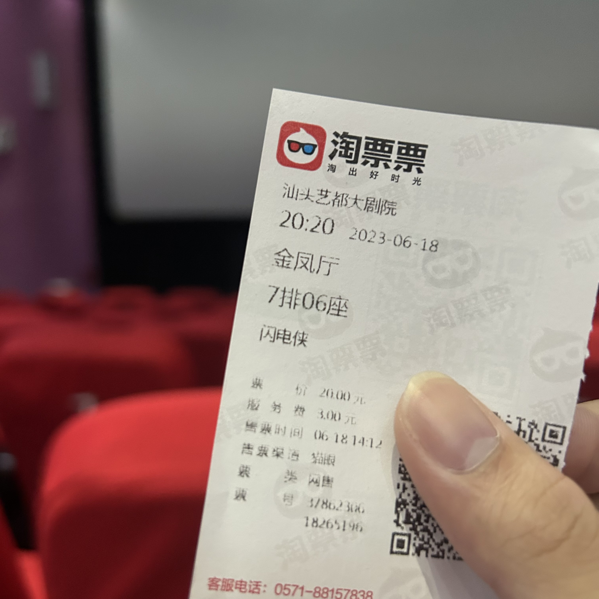
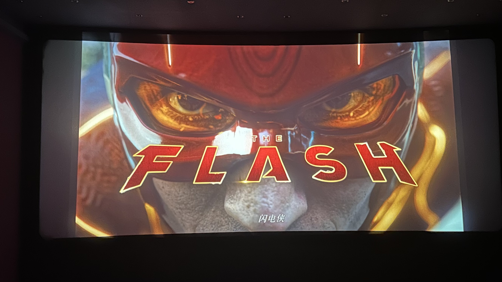

---

title: 《闪电侠》影评
date: 2023-06-18 23:17:01
tags: 影评
categories: 影评
description: "主观体会，有笑有泪（雾）"
---

# 总体感受

好，但没能夸到天上的好。

埃兹拉·米勒，~~aka夏威夷战神~~难怪华纳力保他，确实一人饰演两条时间线上的 Barry ，甚至让我忘了都是同个演员，把不同时间线上的 Barry 刻画得有血有肉。

看预告以为反派是佐德，看正片前半部分的反派急速者以为是黑闪（时间亡灵），而后才知道反派的闪点后的 Barry ，也有点像剧版《闪电侠》第三季的萨维塔定位。

总体而言，作为爆米花电影，不会那么公式化的呈现，也不会无脑合家欢，主要是 Barry 和母亲的情感戏是真的增色，才能忽略掉其中部分的缺点给予好评。

# 该夸的

 1.感情戏，无论是 Barry 自身的发展，通过闪点时间线的 Barry 心境成长，还是与母亲的情感烘托，可以说成功把这部极具争议的电影给拉回来。

 2.扎导版的 DCU 概念华纳算是给足了尊重和承认了，实在难得的一件事。

 3.DC独有的彩蛋。我不是DC粉，但能看出来电影还是会充斥挺多 DC 粉看得懂的梗，除了基蝙，不能转头之外，拉卷尺量电梯厚度确实没想到，以及神速力中时间线互相碰撞我是不是看到了剧版《闪电侠》地球二杰森·加里克的闪电侠形象？*（或者说是初代闪电侠？）*

 4.部分特效确实震撼，例如开头闪电侠起跑的镜头是先拉远，后再跟上脚步动作这点确实给予急速者不一样的体现形式。

 5.门槛不高，无论是了解前系列电影的，或是完全的路人，故事讲述没太大的门槛去理解。

 6.时间的概念，其中以“时空之碗”来呈现时间线概念确实很有新意。

# 该吐槽的

 1.服道化！服道化！服道化！我在追剧版《闪电侠》到后面就已经感觉紧身又轻薄的服装已经是灾难了，影版又刷新了我的认知，垂肩、闪电纹路过于 LED、泡泡超人翻版……实在不想吐槽了。

 2.还是特效，前文确实夸了部分，但还有一部分太 CG 化了，例如上文说的起步镜头震撼，但为什么要给跑步全程镜头，太CG化了，一眼我还以为是在哪款 PS 游戏上面截取的画面。

 3.反派刻画，佐德演员塑造只能说工具人作用，确实没错，但真反派的闪电侠的塑造太过没头没尾，没啥压迫感，或者说草草了事，算是优点也算缺点，毕竟刻画闪点 Barry 的成长算重点，但这个 Barry 又如何堕入神速力去纠结于改变时间线的变化，又草草了事，如果刻画的好真的能是个经典的反派角色。（塑造反派也算DC优势了）

 4.逆闪的缺席。从很久之前知道影版《闪电侠》立项开始，就对逆闪的刻画有所期待，结果预告出来看到几个角色，就知道逆闪寄了，没这选项，可惜啊可惜，有的话这和老爷与小丑，大超和卢瑟这种宿命对决同样经典了。

 5.结尾的硬伤。都已经体会过改变过去开启闪点死了这么多人的结果了，为啥回到过去纠正自己改变时间的错后，又把番茄酱架放到货架上面操控改变监控证据，不算另一个改变时间的错误？所以算是不吸取教训死用 Bug？

