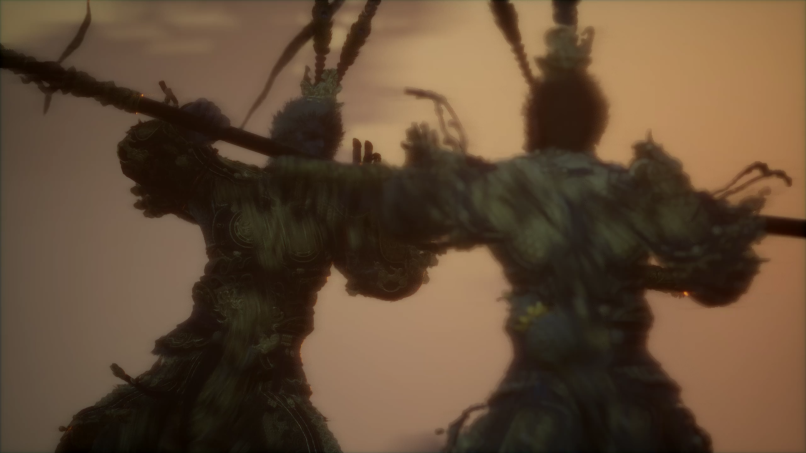
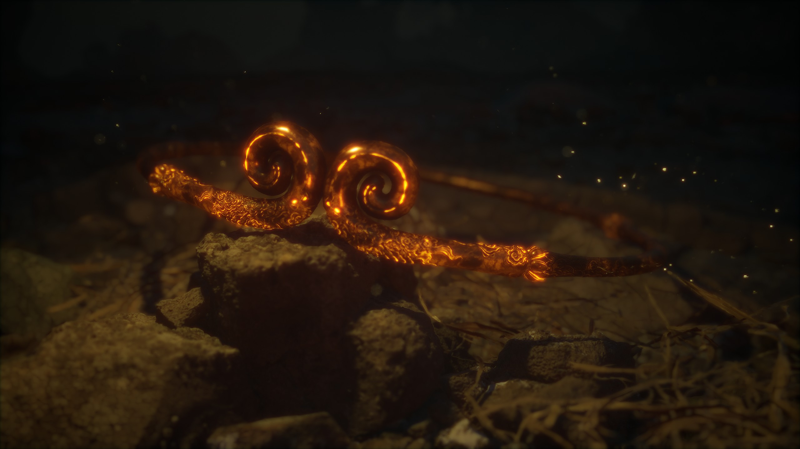
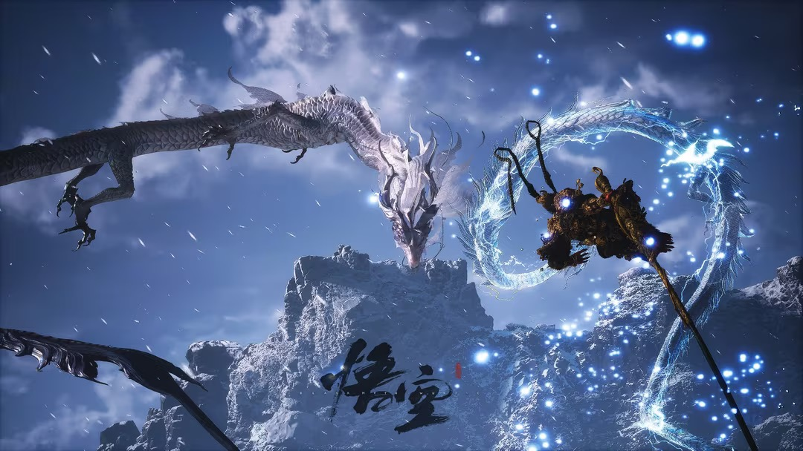
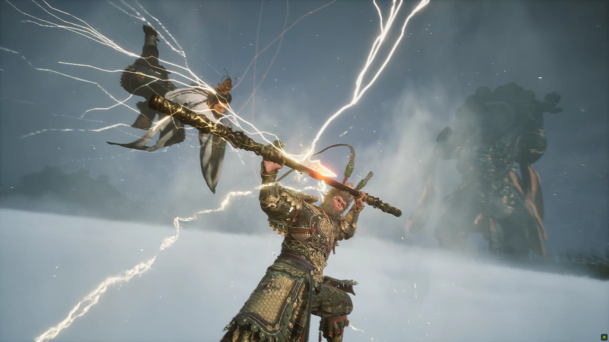

# 《黑神话：悟空》发售

近两天最火也最出圈的事件，便是《黑神话：悟空》的上线，我作为游戏玩家也是在预售首天就购买，20 号当然也是蹲点解锁玩。

总体来讲，作为国内 3A 大作，对得起公众的期待。无论是立绘还是故事，都是精良制作。

而对于其中的意义，正如很多玩家所激动的理由所概括的——

> 玩过很多 3A 大作，但进入游戏中第一件事，先找到 setting  —— language —— 按右翻页祈祷出现「简体中文」或者「繁体中文」，至于到底有没有中文，游戏不会管你，如果没有，只能去网上搜索有没有汉化补丁，或者看着 steam 评论区差评中国人留下的「WE NEED CHINESE」；当别人都能拿着游戏里一张张恢弘的画面去旅游实地打卡，可以向同为游戏玩家介绍尼罗河流域的兴衰，分享都市里的落日飞车，探索光怪陆离的魔法大陆，享受着中世纪穿戴着银白色的盔甲与利剑，征服着世界。而我们明知中华上下五千年，无论从历史或者是文化，单拎出来都是恢弘的内容，却无法找到承载着血脉的游戏载体。
>
> 而《黑神话》，正是孙大圣在众多参差不一的游戏中狠狠砸下去的那一棒，真正做到了中国人百分百沉浸在独属于文化血脉的故事。

# 优劣之处

先说缺点吧，游戏圈已经讨论挺多了，我个人认为主要有两点缺陷：

1.地图设计的瑕疵和指引缺失；可能是游科的首个 3A 大作缘故，在魂类游戏的要素上面仍有欠缺。地图设计很大，取材也是来源于我们国内的山川水秀，但致命的就是没有地图的情况下，有着空气墙的引导。

这就导致有时候，你瞅着你的左前方似乎有一个岔路口，似乎跳过眼前的大石头就能进去，当你兴致勃勃的跳过去，迎头撞上的就是空气墙，此时玩家不由得会升起一种挫败感和烦躁感。

层次性的缺乏也是有点致命，我个人在跑图探索的时候，尤其是第二章的黄风岭与第三章的小西天，一大片同色调的黄土高坡和雪地是很容易让人有一种疲劳与懈怠。似乎花时间和精力去探索一大片区域，还要花着撞上空气墙白费功夫的风险，这时候给玩家的体验是致命的。

而地图机制的缺失更是加重了这一负面体验，不过还好到如今有第三方的游戏平台制作了实时引导地图，弥补了这一致命缺陷。

2.战斗视角的别扭；游戏是作为第三视角操作天命人进行战斗，而在视角锁定攻击对象后，游戏会给你一个视角来面对，而视角如果需要改变，手柄玩家只能操作横杆。但有时候游戏给你的视角有些别扭，可能背后正是一堵空气墙的情况下，你的视角体验会极度凑近在攻击对象的近处，而看不到天命人的位置和状态。

其次，体积差异巨大导致的视角偏差。举个例子，黑熊精与亢金龙的体积，一个是大体积，一个是飞天位置；而天命人仅是一只猴子，体积是比较小的，如果近身打一套输出的话，很容易导致玩家视角仅有裆下的攻击，如果像亢金龙那种会飞天的，aoe 伤害施放的时候，在天命人头上时，玩家视角会是仰视的状态，地面上的雷电提示是很难第一时间看到的。

说完缺点，也该说优点了。

1.美工设计基本上无可挑剔。无论是披挂，或者是地图场景设计，人物动作模块，基本上都是细致刻画的；包括沿路的一些寺庙、建筑都是通过实景扫描制作的。

在每一章节也是看得出诚意满满，不同的章节故事介绍既有中国动画的制作，也有人偶戏的元素。

2.文化色彩的浓厚。这也是吸引着许多中国玩家的地方，往大的说，取材于《西游记》的故事，所有中国人都是十分熟悉的；细节方面，如第二章的无头菩萨，贯穿天命人的唱戏为中国的陕北说书；包括佛教文化与道教文化，可以说游玩过程中带给玩家更多的属于中国人的文化魅力。

3.**故事叙述的宏大与独特。**如果简单的主线剧情，即是玩家作为天命人，由花果山老猴的故事中，启程远游，一路降妖除魔，搜集孙悟空阵亡时散落的五根，最后重回花果山，挑战美猴王的残躯，成为新一轮回的美猴王，戴上紧箍圈，在石头接着孕育。进行新一轮的西游轮回*（这是第一结局，没有挑战二郎神的主线）*

而如果挑战二郎神后，再去挑战大圣残躯。则会进入第二结局，即孙悟空终于将六根集齐，回到花果山，以蒙太奇的手法回忆当初大闹天宫前和众多兄弟妖怪的热闹场景，如今只剩兵荒马乱，但仍然披上大圣披挂，重闹天宫。

可能在游戏过程中，很多人都会不假思索地消灭沿路的小妖，妖王，Boss；但闲暇之余看看「游神图」查阅各类妖怪的故事，却发觉每一个妖怪都有自己的想法，似乎并不是十恶不赦，而是因果，轮回，意外导致的妖魔修行，甚至不乏有一些妖精是做过好事的。

而对比而言，各路神佛似乎光明磊落，但细细品味却不难发觉，都在天命人寻根之路上做过见不得光的行为；有些因为报复，有些为了惩罚不信佛的人；这也解释了为何游戏开头 cg 中，在孙悟空变为麻雀明明能躲避杨戬的追捕的情况下，头上原本摘取的紧箍圈又重新出现在大圣的头上。

似乎孙悟空想辞去「斗战胜佛」的神位，回去花果山安享清福，无论是天庭或是佛界都不答应，最后联合各路妖王一起铸就大圣的陨落。

仔细想想，像八戒和二郎神所说的，孙悟空不可能轻易的就被杀死，只有他自己。那为何孙悟空还要任由二郎神消灭自己，

似乎答案就是出在「天命」上，天命即各路神仙的安排，像是多方无形之手，而芸芸众生只会沦为被摆布的棋子，无论是各路妖怪还是孙悟空。

对悟空而言，完成西行的 KPI，被赋予了「斗战胜佛」的名号，即是天命，但说白了仍会被摆布，不然突然出现的紧箍圈只有是佛界的参与，也是佛界们对大圣大闹天宫的反对态度。

而相信所有人都会知道，大闹过天宫，销毁过生死簿的孙悟空，也绝不会顺从这样的天命。

所以更像是和二郎神这样一个「刺儿头」合作演一场戏，由二郎神消灭孙悟空的肉身，只等天命人击败各路艰险，回到二郎神，通过挑战拿回大圣最重要的根器——「意」，真正摆脱天命的安排，真正的为自己而大闹天宫。

*当然这只是我的个人解读，如有偏差敬请谅解。*

4.彩蛋的设计。像黑熊精或者黄风大圣，两者作为两章最后的 BOSS，挑战难度十分巨大。很多人如果纯粹拼技术和操作，可能得很久才能通关。

而游戏也有隐藏支线，奖励则是来自于《西游记》的剧情，例如黑熊精擅长火攻，隐藏支线奖励为火罩子，即故事中出现的唐僧的袈裟，无视火攻伤害。

又例如黄风大圣的章节，隐藏支线奖励的是定风珠，有效克制黄风大王的黄沙领域。

而这也是独属于中国人独有的彩蛋与浪漫。

# 总结

《黑神话：悟空》，在很多玩家心目中，可以说是今年最期待，也是最肯定的国产 3A 游戏，也是无限的希望，孙悟空的这一棒，能敲开中国精品游戏市场的光明未来。

仅此祝福。

最后放一些我在游玩时截取的惊艳画面。 :) 

