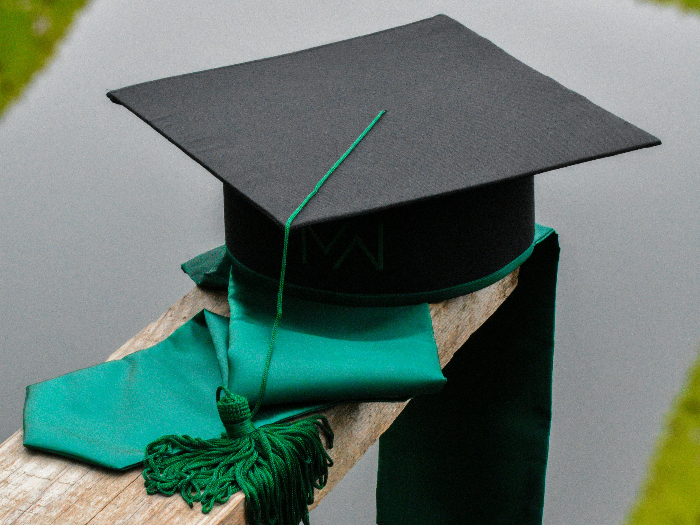
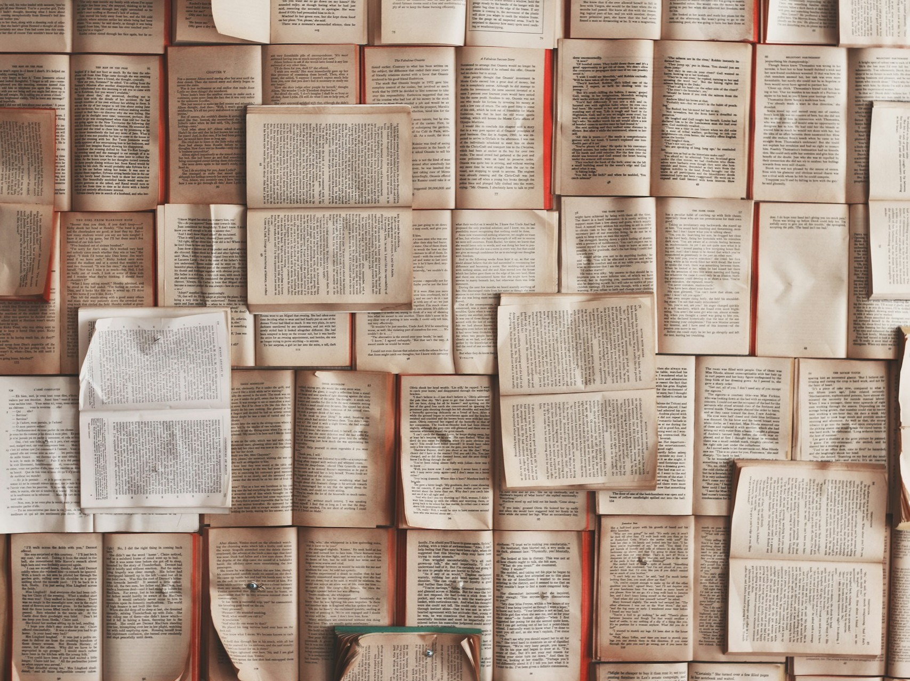
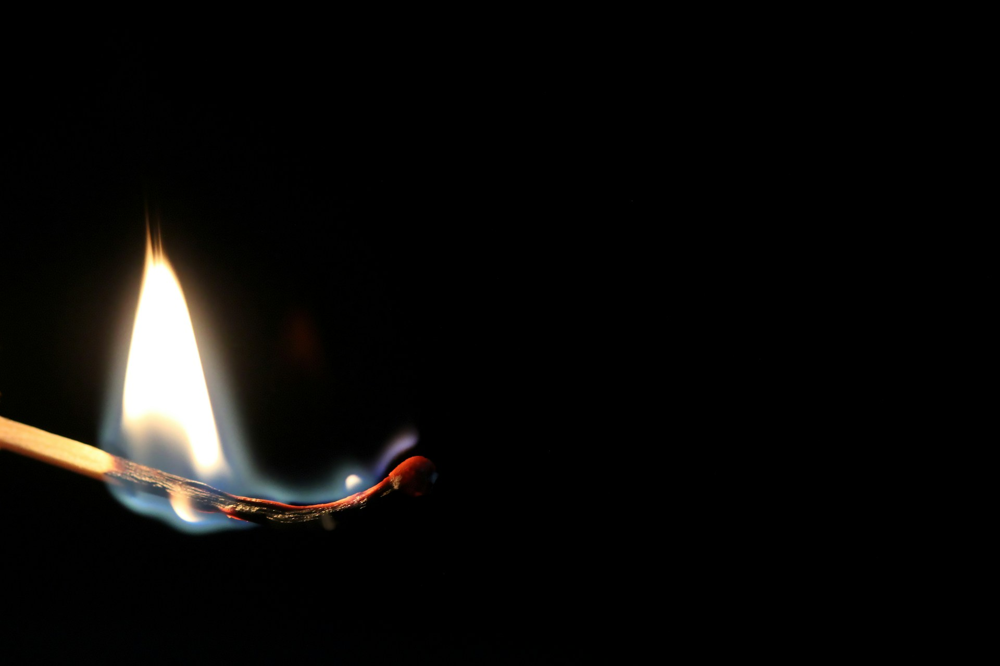

## 每年的一段特殊时间，周而复始

又是一年毕业的时间。

看到朋友圈的读研同学分享，或者是官媒上宣传的沸沸扬扬的毕业季，抑或是我自己班的学生已经彼此之间传递同学录有段时间了，

都在告诉着我蝉鸣盛夏的时候，也是离别分开的时刻。

## 闲聊之下我对自己的错愕

前段时间，在楼下吃饭的时候，刚好碰到政教处的主任突然问我一句：

“现在这个时间，会不会内心有些不舍的情绪？”

我被问愣了会儿，公式化笑了笑，说声：“还行，现在还是比较操心他们的复习进度。”

实质上，我内心对于学生的离开并没有任何波澜。

## 自我开始对毫无波澜的剖析

### 一些抽离自身的即时想法

离别这个词似乎很沉重，代表着时间或长或短，没有办法再次取得联系，

或者在我的理解里，是属于再也没办法重温某种熟悉的感觉。

回想我当年的本科毕业之际，拍完学院的毕业照片后，有很多的朋友，包括认识的人都会来找我合影，

看朋友圈，挺多不同专业或者同专业的朋友除了自己和他人的合照之外，更多还有学校的一些风景画面，大多都是在表达对于四年青葱岁月的不舍

而我更多是开心和感激，对我而言，能够在别人的脑海里占据一席之地，本来对我自己就是一种无言的肯定。

但是探究我自己，似乎我很少会对一些人的离开，会有一些不舍或者难过的心情。

就像我微信公众号的简介：

> 想记录这个世界的过客

如果让我评价自己，往不太好听的方向来讲，我好像很不自觉把自己放在一个独立于事件的过客的地位上，

对应的，我对于别人的看法，都是以一个过客作为基础，再次之上，再一步步建立起情义的砖块。

原因是什么，我也懒得用拿什么人格分析的绿老头因素来解释，尽管解释得通，

对于自己的习惯，我总会在浸入到情绪的前几秒后，瞬间抽离出来，在脑海里构筑起类似于上帝视角，

可能是为了避免情绪的洪流击溃自己的情感防线，自然而然的站在一个理性的角度的审视情绪的流淌。

得益于看的文学作品比较多，总会不自觉的寻找类似的故事匹配，进而类似于自己编写着接下去的人生故事；

无论是对我，还是对方。

### 离别的意识萌芽

很早的时候，我就有着一个朦朦胧胧的离别观点，尽管小的时候没有发觉，而是在往后的成长不断明晰：

> 这个世上，除了生死是大事，其他的都是小问题。

引申下来的离别话题，即是**除了死亡，其余的离别总是或长或短的离开**。

我小时候，奶奶的离世，让我逐渐有着对于离别的一种竟乎冷静的习惯。

印象很深，在第二天去奶奶家里看望，敲了半天门没有人开门，好不容易拿到钥匙，只见到记忆里那个开朗的老人，很安然地睡在床榻上，

现在想想，可能是作为一个老年人最无憾的离别方式，

当我的母亲满脸泪水地让我跪在床前磕三个头，做最后的告别时，

我恭敬地磕完头，认认真真地看着奶奶沉睡的脸，我没有哭，也没有多余的情绪泛滥，

我不伤心，因为我也清楚她不痛苦；

尽管很小，但也能意识到，从这一刻后，我再也没办法看到奶奶的神情，或听到她充满疼爱鼓励的言语；

那是我直到现在最认真的一次端详。

走出门外，自己站在步梯楼道，望着老式楼梯窗口透下来的光线，

云朵很厚，压得阳光没法痛快地照耀，空气有些寒凉，一口呼吸的凉意，让小时候的我意识到，这是真正意义上的离别。

## 后续的态度

自此之后，我似乎很少再接触到离别，或者说，我很少再把一些情况看成是离别。

求学之路肯定和自己的同窗好友告别，但在我的理念里，大家都为了一个共同的大方向而努力过，合作过，

彼此在求学期间也留下了或愉快，或美好的记忆，

这些都是拼凑成更好的、更成熟的自己的要素。

对方的出现对自己是这样，如果自己能成为对方的美好要素，

就像我上文所提到的，那就是一种无言的肯定。

回到上文，政教处主任说的「不舍」，在我这里并不会有太多的想法，

对我而言，完成我的工作，教会他们做人，在他们的求学经历中，不敢说有什么重要作用，能护送着他们顺利前进就好，

毕竟现在的我，不否认未来可能有再前进的可能，但大部分情况下如同路上随处可见的树一般，

无声地扎根在一处地方，发挥着自己所应该尽到的职责就行。

——END——

