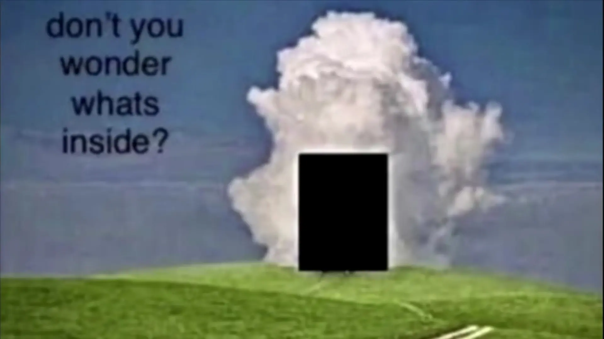
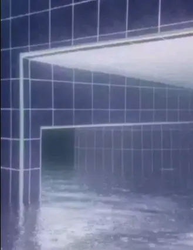
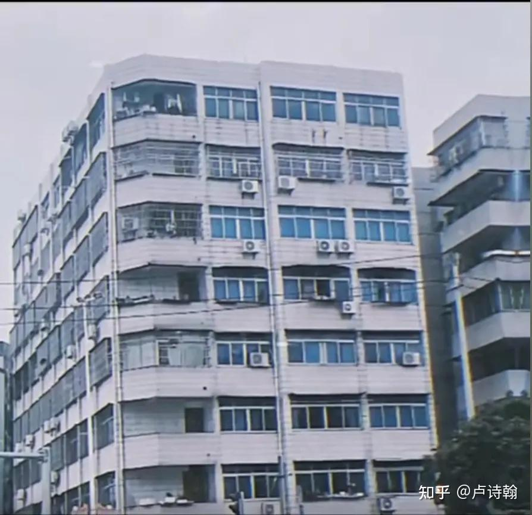
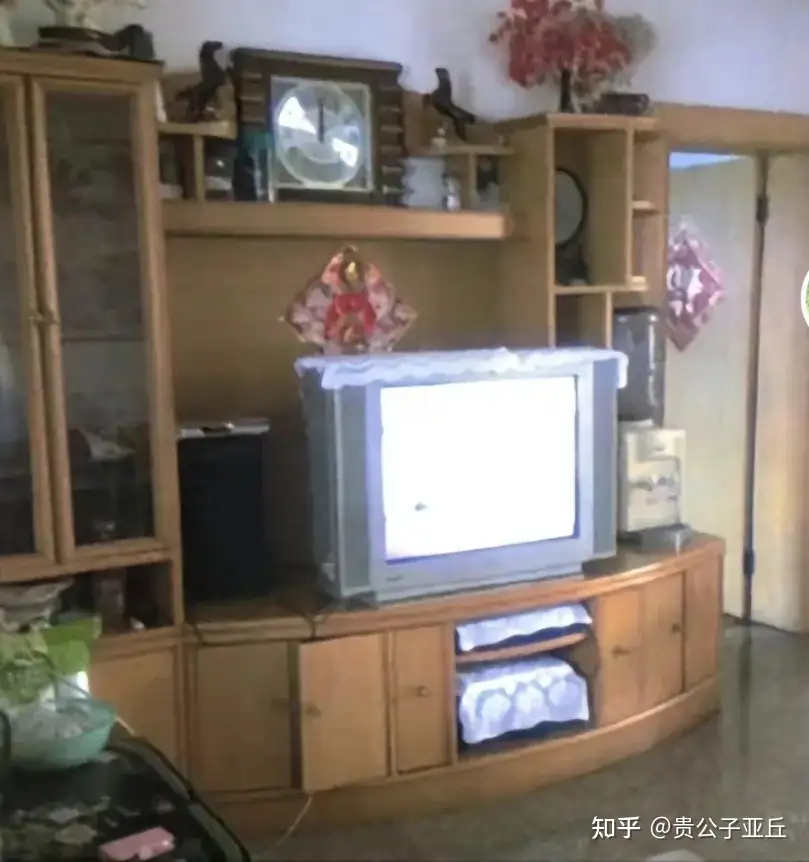
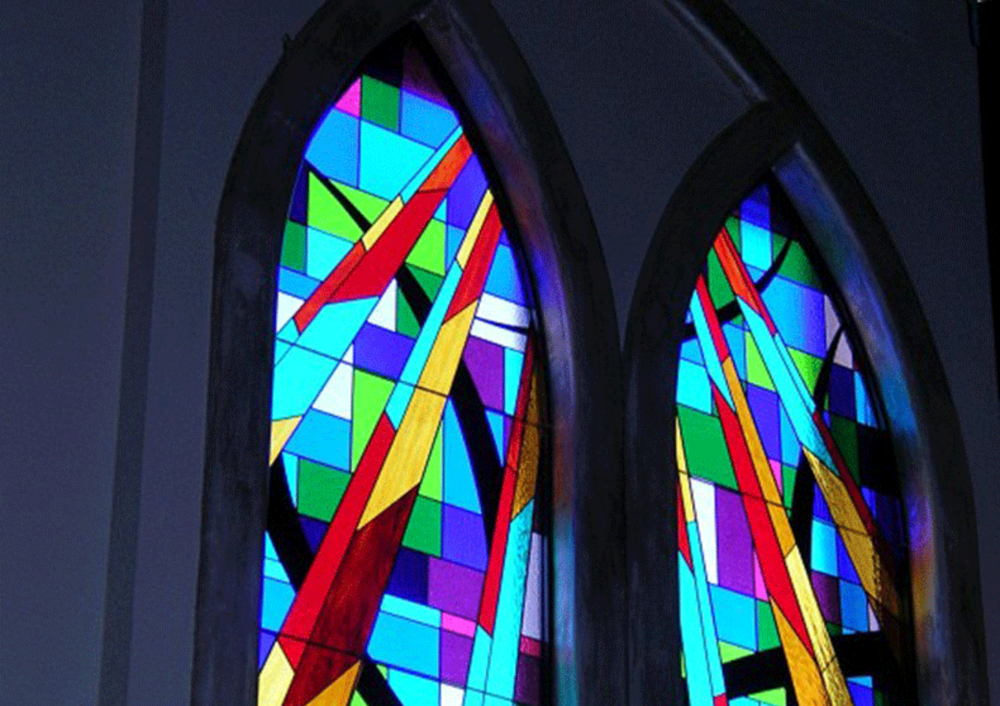

# 写在前面

突发奇想想着写下这一篇文章，除了拾起许久未记录的想法之外；更重要的是近期被一些老歌勾起来的古早回忆，成为写下这些文字的催化剂。

迟迟未动笔，一方面在工作之余除开休息放松时间，更多也是察觉自身对文字，或是对自己想法的钝感力愈发严重，

以至于一闪而过的想法，淹没在日常琐碎之事中。

而另一方面，对于选材也无法有所界定，似乎各领域都浅尝辄止，无法深入思考。

将以上讲述，并非托辞，仅是为了给以后于警醒。

# 关于梦核

> 梦核是一种超现实主义美学，这一美学常常以图像、视频、音乐等媒体作为介质，来描绘与梦境有关的情景（例如白日梦、噩梦等）。梦核与怪核有一定的共性。

与我而言，在了解到梦核之前，更多先是遇到怪核的照片，也就是以低像素高饱和度，且不符合常理的事物搭配在一块的图片，给人以一种在普通事物下隐隐的不安感。

当然，了解我的人可能也知道，我是不喜欢那种没事给自己找恐怖事物寻求刺激的人。

于是在相关联搜索下，先后了解到池核（也就是以游泳池为主要元素展现空旷、纯洁、但又留下极度空白的不安感受），到后面的梦核。

梦核一般在中国互联网语境里，反而与恐怖沾不上边，而是和童年那种模糊的记忆有所联系，

而童年，可能是处在 2024 年那一种压抑的、喘不过气的压力下，为数不多的精神寄托之一的地带。

# 记忆残存的碎片

实际上，可能每个人对梦核系列图片，第一反应则是似曾相识，带着属于 90 年代至 00 年代的摄像设备独有的低饱和度和模糊像素的记忆，

记载着童年时候眼睛所接触到的事物，例如路边奶茶店、家中木色柜子和摆放着零零散散的物件。

*（这个可能放我现在的城市可能还能随处可见到这般建筑）*

*(似乎当时的年代里每家每户都会有如此的电视机)*

对我而言，梦核很多都能触发零零散散的记忆，但在了解到梦核这一美学形式之前，在我脑海里也留存着一些刻印在心里的只言片语般的画面。

## 琉璃样式的窗户

在我的记忆里，如果接触到西方基督教的教堂内部的结构，势必能看到五颜六色般的琉璃。

但我每每看到时，总会一瞬间有所恍惚，并非是有关宗教的回忆，而是和我的奶奶有所联系。

印象里在我还未读幼儿园的时候，在父母外出工作时，平常都是我的奶奶照顾我，而有时候我的奶奶会带我出去踢桃（也就是闲逛）

而有时也会带我去她的朋友或是亲戚家里做客。

当然我是不认识的，也没意识到对方是谁。

还记得有一次和奶奶前往一户朋友人家做客，那时正值晌午，奶奶和朋友你一句我一句聊得开心，原本我是想着有玩具可以玩一玩，

可惜对方似乎没有什么多的玩具。那时也带着些困倦，就自己躺在客厅的木椅上，耳边传来的是长辈们交谈聊天的言语，夹杂着外面不时传来的货车喇叭声，

（现在想想可能奶奶朋友家住主要交通干道附近）

而昏昏睡去前最后一幕眼睛所看到的画面，则是我躺在椅子上，脸朝着窗户，外面的光亮透着长辈家的斑斓的琉璃窗户打在脸上的画面。

醒来之时，已是天色转暗，身上不知何时被长辈们盖了张薄薄的被子。

喝了杯水，跟着奶奶的教导，和各位长辈摇摇手告别后，牵着奶奶的手亦步亦趋地回家。

那一刻总觉得带着小孩子那种一切烦恼抛诸脑后的感觉，在小时候并未觉得有何奇特。

直到未来经历了许许多多的事情后，在面对一些无法避免的负面情绪时，脑海里总是想起当年所留下的无比怀念的惬意。

许多年前那扇琉璃窗，也是和那一份惬意画上了约等于号。

## 堆砌着建筑材料的施工场

以前家里开店还在卖服装时，曾雇了一位姐姐帮工，平常过来帮忙照看店铺接待。

印象在我小时候的年纪，那位姐姐也才二十来岁出头，对她的印象已经很模糊了，唯一比较记得比较清晰的可能是她的眼睛和说话语调，

给人一种很亲近的感觉。

因为自己无聊时会自己跑出去走街串巷，当然范围不超过一条街，

而店铺后面应该是一个楼盘的开发前期，还没有施工队伍进驻，只是有一些沙石砖瓦堆积在空地上，

而那时候的我，常常会光顾那块工地，通常是捡起石头使劲丢在一大片沙地，或是拿起碎石无意义的丢在一堆碎石堆中。

然而周围店铺的孩子比我大了快五六岁，自然有着不可逾越的「代沟」，

所以自己常常形单影只自己玩耍。

而在一天中午时，店里父母应该都有事外出，仅有我和那位姐姐，我正闲的没事时，突然想起来身边有这么一个姐姐能陪我一起玩，

于是乎软磨硬泡，想要姐姐陪我一起去后面的工地玩耍，起初她是不答应的，但奈何不了我一直软磨硬泡，

最后还是答应和我去后面玩，似乎只答应去大概十五分钟？

反正和姐姐玩耍的时间十分短暂，但是是我那一天最开心的时间。

*可能是独生子的自己终于第一次找到愿意能和我一起玩的人了*

当然后果似乎是母亲到店，刚好我和那位姐姐后脚回到店里，于是我自然而然被母亲劈头盖脸地骂了一顿。

虽然没印象那位姐姐有没有被骂，不过站在这个角度，可能也是被训斥过一番，因此到现在我还是隐隐有些抱歉的心理。

当然后续可能店里也不需要帮工了，在某一天后，我也不再像往前一样，早上一到店就看到那位姐姐。

唯一残存印象，和那位姐姐最后一次见面是在陪母亲去菜市场买菜，经过一处卖桔的地摊时，母亲突然和摊主打了招呼，

我循声望去，看到那位姐姐戴着草帽，同样还是带着亲近的眼睛和笑容，也和我打了声招呼。

从此之后，我也再也没见过那个带着亲近的姐姐。

*（当然前段时间和母亲聊到菜市场的这次见面，母亲的说法是压根没有，可能是我记串了）*

但我还是相信那份带着亲近的笑容，以及记得在施工场上无比开心的那份短暂时间。

## DVD 播放前的星云穿越动画，及带着磨痕的 DVD 光盘

曾经有挺长一段时间是生活在自己的二叔家的，在那个年代，我的二叔对于音乐都是情有独钟的，

所以家里除了有电视机之外，还有一台挺高的 DVD 放映机，以及带着两个很高的老式喇叭音响，以及放在电视旁边可能说是「数以千计」的 DVD 和 CD 唱片。

当然对于一个还没有读小学的小孩子，音乐这种肯定是不会感兴趣的，感兴趣的只有动画片，

而在那个年代的动画片，我们这个年代耳熟能详的「虹猫蓝兔」都还没出现，

印象那个时候流行的是「蓝猫淘气」，主角两个，一个蓝颜色的猫，一个浅绿青色的老鼠形象。

而作为我男方家族里第一个出生的小孩（对我的堂弟堂妹们都还没出生），奶奶自然而然也对我宠爱有加，知道我喜欢看动画片，

于是买了一盒 DVD 给我看，我还记得很清楚，叫「蓝猫淘气三千问」。

而我的二叔也愿意让我随时随地就播放那盒 DVD，

还会帮我把 DVD 放入比我当时身高还高的放映机里，这时候电视屏幕就会出现类似于星云遨游的画面，

当然现在来想相当于 DVD 初始动画，是可以遥控器跳过这个开始动画。

所以二叔那时候就会叫我「快，快去拿遥控去按下跳过键」，

而我在小时候并不理解什么叫初始动画，还记得那个时候的理解是，我得赶紧去按遥控器的跳过，

不然在星云里飞太久，那「蓝猫淘气」就迷路了，也再也看不到他们了。

（没错，非常幼稚的想法，但也确实是一个啥都不懂的小孩子可能会诞生的幼稚想象）

而在某一天，故事放到一半的时候，电视突然花屏了，播放也无法继续下去，

我也没纠结太多，似乎是觉得提醒我时间到了，不能再看了，我自己的做法就是关闭电视，去干其他的事了。

直到有一次，二叔难得和我一起看 DVD 动画片的时候，还是在相同的地方花屏，

而二叔察觉到问题，走上前拿出 DVD 光盘，拿了个海绵刷刷了刷光盘，再拿到灯光下一照，

和我解释「你看这光盘背面这处地方，已经带花纹了，所以运转不了，后面的内容也没法接下去继续看了……」

而奇怪的是我倒也不哭不闹，似懂非懂的第一次知道，原来一些我喜欢的东西不是我没有，而是因为一些我不懂的理由，无可奈何地接受其负面的后果。

小的时候对于这种感觉没有太具体的感受，放到如今想一想，可能是在那一次才知道「遗憾」的感觉是什么样的。

# 写在后面

讲了这么多，各位看官如果能耐下心看到这里，对我而言也是无比荣幸，

能够容忍一个人在这里「絮絮叨叨」这么多似乎是杂乱的、带不了太多切身体会的事情。

回到梦核，我看过的一些评价，能够让人们有所感受的梦核照片，实际上提取了每个人在以往童年生活时的「最大公约数」，

才能让看官有所回忆。

而在如今踏入到压力愈发庞大的世界，也会愈发的念旧，去追寻梦核带来的那种独属于每个自己的潜藏喘息的记忆。