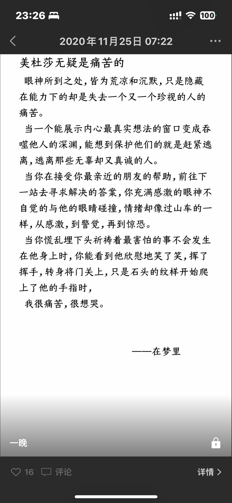

# 写给陌生人的信

在「人民文学出版社」的微信公众号上，读到苏童写的一句话：

> 所谓作家，就是那些给陌生人写信的人。

回想起自己五年前选择「汉语言文学」专业，一方面确实是高考分数以及就业前景的因素限制之外，

我确实憧憬着要成为那个为陌生人写着信的人。

也正是这么多年来读过许许多多古今中外的作家们献给人们的信，

或优美、或伤感、或思考的想法

才也想着为其他人同样地创作着同样的心理价值的内容。

还记得大一班级的自我介绍里，许多人都是介绍自己向往着作为一名人民教师的愿望时，

我可能是为数不多的不是这个答案的人，而是回答——「文字工作者」

# 但却逐渐的撕掉了这些信件

为了实现这么一个小小的愿望，或者说是文字创作的瘾，

大二疫情时期，创建了微信公众号，包括大家现在看到的平台，博客，

都是我为了满足自己对于文字创作的需求。

而现如今为什么又会想到这样的话题？前几天翻了翻过往的朋友圈，看到在 20 年 11 月的自己曾经写过了一段文字：

> 美杜莎无疑是痛苦的 
眼神所到之处，皆为荒凉和沉默，只是隐藏在能力下的却是失去一个又一个珍视的人的痛苦。 
当一个能展示内心最真实想法的窗口变成吞噬他人的深渊，能想到保护他们的就是赶紧逃离，逃离那些无辜却又真诚的人。 
当你在接受你最亲近的朋友的帮助，前往下一站去寻求解决的答案，你充满感激的眼神不自觉的与他的眼睛碰撞，情绪却像过山车的一样，从感激，到警觉，再到惊恐。 
当你慌乱埋下头祈祷着最害怕的事不会发生在他身上时，你能看到他欣慰地笑了笑，挥了挥手，转身将门关上，只是石头的纹样开始爬上了他的手指时， 
我很痛苦，很想哭。 
_——在梦里_

*我还是很难想象当年的我能写下这段文字*

看到的那一刻，我差点以为自己是在哪一篇文章摘抄下来的文字，

再仔细想想，好像这是我自己亲手写的，起因是因为晚上睡觉做梦，梦到自己站在美杜莎的第一视角发生的事情，

而其中的心理变化又十分的真实——以至于我起床去上早课，走在路上仍然无法忘记那种绝望的情绪，

于是在教室里敲下了这段文字。

但站在如今的时间点回头而言，似乎已经许久没有这样的心理感触，或者是文字的敏感度了；

这里的敏感度，并非是对文字的遣词造句的敏感；而是对文字内蕴的情绪，那一种心理之间的共鸣，也随之远去。

# 什么时候丧失的

似乎并不是突然而然的，而是逐渐累积的。

印象是到了大三后半程，面对着随之而来的发展压力，又是魔幻的社会新闻，引发出的一系列思考。

文学里曾经带来的美好，似乎与现实的情况有着极大的反差，也不禁让我想探究——真相到底是一个什么样子。

以至于我在某一时刻，看着手上那些的文学作品，突然产生一种想法：

为什么这些文字带给我的永远是伤春悲秋的情绪？

说的不恰当一些，我似乎背叛了文学曾经带给我的美好，转身冲向那冰冷的现实。

这好像也是一种无法回头的路，当看到越多的现实，越对营造出的美好怀揣着多一分的怀疑。

所以我那个阶段看得最多的书籍类型，不是文学，而是社科。

其实「作家」之所以能成为这个职业，似乎能在面对惨淡的现实中，宁愿去相信总会有着美好的存在，

并不厌其烦的构筑她，向人们介绍她。

可惜我似乎丢失了这样的美好憧憬，留下的只是日复一日对工作的疲倦，和对现实的冷眼。

也是一件可悲的事。