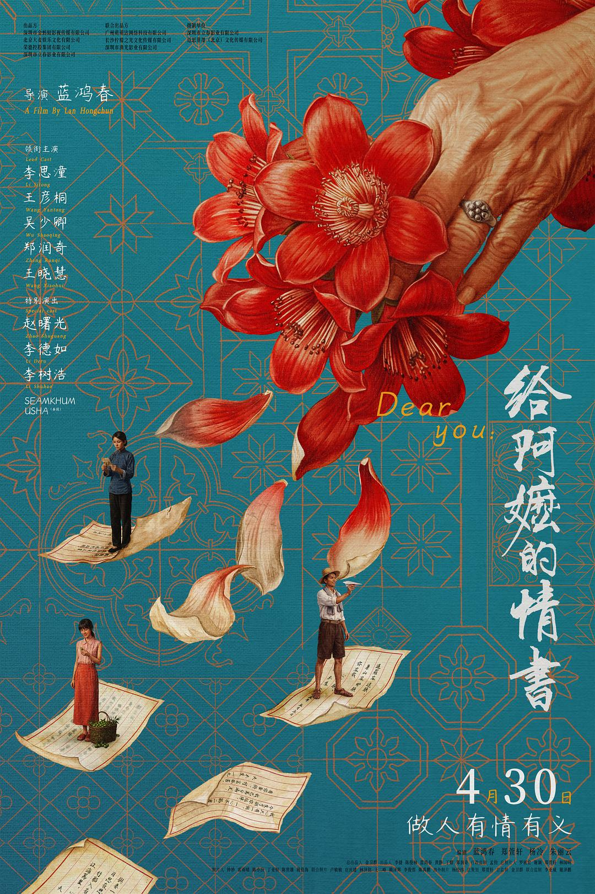
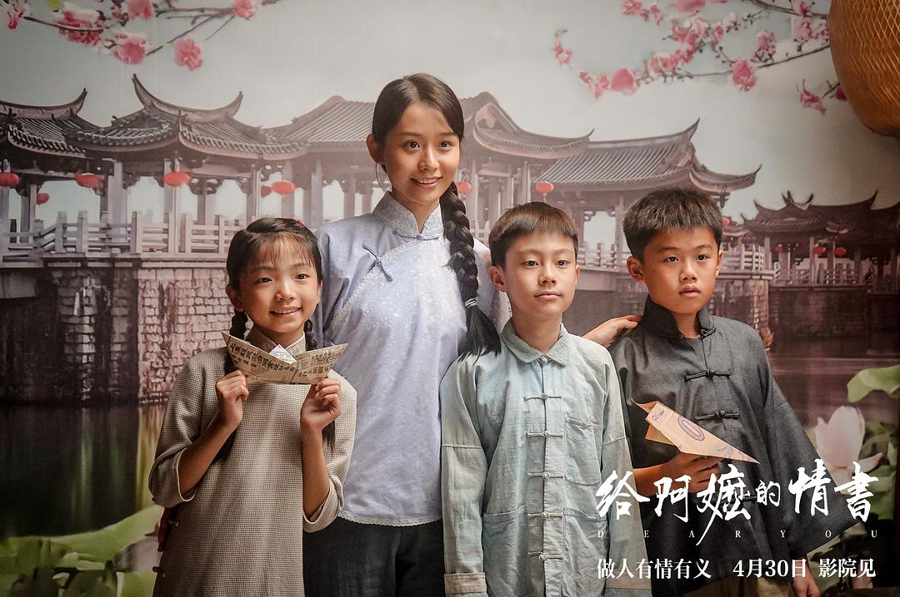
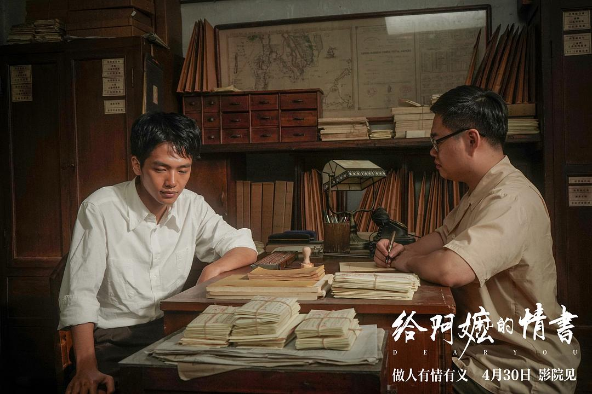

## 前面的一点碎碎念

一个是搁笔闲置许久，打开我的草稿箱，可能还在3月份的一个话题，写到中间就暂时地停滞。

二是五一假期的五天匆匆就过去，前两天与大学舍友们叙情义，第三天回来办事，也是忙着忙着想起了这部五一档期电影。

想想潮汕人的方言电影，应该是无压力，结合最近朋友圈对此电影的好评如潮。

于是决定在这第四天好好观影。

看完评价：**目前为止估计是我上半年中情感最为充沛的一部电影**

## 叙事节奏

还是很难想象一个名不见经传的导演，能够把情节叙事调动得很游刃有余。

作为潮汕人看这部电影的好处可能要比只看字幕要更多一些，一个是前期的轻松化叙事，夹杂着其中人物的方言表达，

可能带着一些粗话，但可以保证并不粗鄙，因为基本上每个人小时候总会被自己的长辈这么的说过，

所以在角色的情节表达中的方言，更多是起到让人会心一笑的作用（当然本地人会get到）

前期的人物都是以一种幽默诙谐的家庭生活闲杂事情来叙述情节，

而随着故事情节的推进，在着急找阿公讨钱的孙子和不靠谱的小叔中，自然而然的勾起了对郑木生是谁？他究竟去了哪里的问题。

当然故事变化线也是愈发波折，直到后面揭示一直通信的郑木生到底在1960年的时候为什么会去世的情感线，通过隐藏在极致深处的信批独白中**“汹涌”**爆发。

为何我说“汹涌”？因为自始至终，全片并没有用到特别爆发式的情感表达来抒情，

只有人物角色在不同时间历经不同事情里，那种沉默的，眼角流淌泪水的，或者手持侨批的特写镜头中，

搭配上独白，配乐，或者是番客歌谣来代替创作者表达情感。

## 人物演绎

对于角色演员的演绎，最开始在观影的时候，带着一些电影分析的思维去看，总会觉得年轻女主（谢南枝）在后面情感爆发的戏份中有一种青涩的感觉，

最开始以为是青年演员的不熟练，而看到后面，也把前面的先入为主的观点改回来，

一个是故事角色实际上在当时都是极为年轻的人，可能连二十二岁都还不到；

另一个，也就像我标题所说的，在极致的克制下，人物的不极度外化的表达，更能让观众去沉浸在当时那种极度悲伤，或者伤心的情感中，

更能让观众后劲巨大。

而演员阵容中，几乎没有大牌明星，要说明星的也就是中老年角色，采用潮汕地区本土的著名小品演员，

信手拈来的演绎也是让人在往事回顾的情感线之余，借由经验老到的演员喘一口轻松的气。

## 价值表达

这一点是我觉得最精巧的方式，*亦或是无心插柳柳成荫的结果*

在国产电影愈发多的今天，可能很多人已经对于影片中加入价值倡导有着天然的敏锐，以至于反感，

而在《给阿嬷的情书》中，可以说如果导演不收力，可能就变成带着极大话题度（更多是翻车话题度）的后果，

我自己观影时，也有一些情节让我下意识的忧心了下，例如木生劝说南枝允许在柴房教孩子中文，可能会被引导成中国文化的传承；

或者是南枝后面二十多年一直寄侨批资助淑柔，可能会被理解为女性主义中的 girl help girl……

但万幸的是，全都没有。

我自己有时候工作会收到任务，和学生普及侨批的历史意义，但侨批已经是上世纪的产物，年代距离远，一般人只看批信内容无法有共鸣，

而电影恰恰只是拿侨批作为情节串联的线索，以实质化的情节画面来诠释侨批中的一言一语，不苦口婆心，却更能起到记忆的效果；

教中文，更多为了服务于人物的人生线发展，而非强调中国文化的传承等高大上教育；

资助淑柔，更多是因为木生的人物感染，和人与人之间最淳朴的情义帮助，

而正在此刻我才理解最开始的影前语关于情义的讨论，

最开始下意识以为又是潮汕地区结帮的交情情义，但无论是两个女主之间互相的不知情的侨批往来，或者是下南洋时工友们的帮助和接济，

都在诠释“情义”二字的价值。

实际上每一个底层的普通人不会想这么多高大上的价值，有的只是朴素的价值观，认为对的，那就去做；有情有义，才能走得更久。

## 不足

当然还是需要讲一讲我个人的一些观点。

可能是经费紧张的问题，在南枝后面的情节安排上有点仓促和带着任务化，一生未嫁，领养到弃婴，后面说到淑柔的回信也让她知道为人母亲的责任，这一个情节处理有待商榷；

另外就是文化隔阂问题，除了影片大部分都是以潮汕话体现之外，上文说过的侨批文化毕竟带着时代背景，可能很多人也无法理解为何一个侨二代会为了素不相识的中国的家庭去供养。而回答也就是以影片开头的核心词来回答——**情义**

## 而让我能感受到爆哭的泪点：

1. 当南枝在码头为丧命的木生烧纸钱，孤零零的南枝，在火盆映照下，一字一句为去世的木生，念着淑柔寄来的信时，火光下流着的泪水，也带着观众的泪点；

2. 当“行船入夜，恰江上升明月，似与你并肩共赏。江海万里，心中念你， 便不觉遥远。”这一内容后面中信件独白中反复叙事，从最开始的木生对淑柔想念的猜测，多了南枝那一种说不清道不明的挂念。

3. 最后两位老人的碰面，当已经老年痴呆的南枝回忆起来，下意识的一句：

   > “我寄的咸猪肉好吃吗？”“好吃的话，我再寄一点。”

   可能一些人不理解泪点，但克制之下那种涌动着的朴素但又真切到机制的素未谋面的人与人之间那种关心，可以激发起人对最朴素情感的真切感动。

——END——

