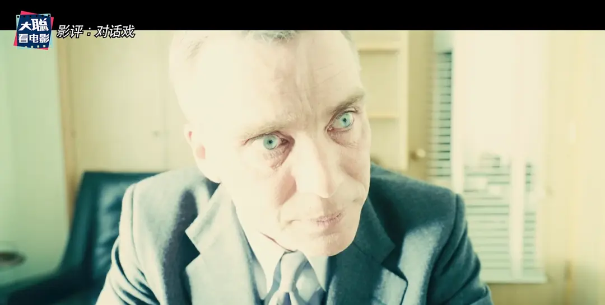

# 总体观感

诺兰，可以算是电影圈的一大IP了，包括我会去看《奥本海默》也是冲着诺兰的名头，奥本海默人物仔细想想才想到初中课文介绍邓稼先里头，有部分对于奥本海默的描写。

在众多爆米花类型的电影市场里，《奥本海默》这种对白戏几乎占据影片三分之二的内容，确实给予观众极高的观影门槛。

*奥本海默成功引爆第一颗原子弹后的近乎一小时的听证会对白戏，我发觉在座观众已经有好几人直接离场不看了（乐）*

对我而言其实还好，除了对白戏之外，由于知识的储备，在观影过程中除了显而易见的情节推进之外，诺兰导演在影片中采用的镜头，贯穿影片的配乐和节奏，都是能给予极大的震撼。

当然，在「白左」思潮泛滥的时代，其实末尾的引起深思的内容，实际上站在不同的立场和角度，仍然是值得商榷的精神内容。

# 镜头

如同预告片，或者是一些观影前的科普视频所表现的那样，影片采用了彩色和黑白两种镜头的叙事模式；

当然和诺兰以往影片中采用不同的色彩镜头代表的意义不同，《奥本海默》中彩色是在奥本海默的视角去叙述，黑白则是站在施特劳斯的角度，在不同的时间线中去看待整场事件；

*BTW 由于自己看了很多漫威电影，虽然一眼认出小罗伯特·唐尼，但不得不说演员确实努力打破「钢铁侠」的固有形象，去沉浸演绎不同的角色*

两种镜头可能由于诺兰的非线性叙事的时间线里，似乎比较容易让人觉得混乱，而两种镜头像是两条直线，在一个时间点交叉，交点则是贯穿于整部影片的事件——对于奥本海默的听证会。

其镜头色彩，也隐喻着对两种人物不同的情感色彩——科学家的天真和责任；政客的阴郁和狠辣。

其实观影后看了许多影评，很多视频都建议尽量买靠后的座位，缘故是镜头很多是针对于人物面部的特写，几乎是以直观、沉浸的视角，让观众面对面的观察人物的心理变化和内心活动——

确实是很直观也很大胆的手法。

# 爆炸

虽然有句话称为「艺术即是爆炸」，

但，影片并不是在讲述如何造一颗原子弹，并引爆它的全过程；就像我在前文所说的，通过大量的对白，去展示一个人——奥本海默，在原子弹引爆前、引爆时、引爆后不同时间的内心变化。

因此爆炸的镜头，很少，但少得令人印象深刻。

爆炸的镜头，出现了三次——

哦不，严格意义应该算两次半（没记错的话）

## 第一次

则是喜闻乐见的原子弹试验引爆的镜头，很震撼，这就不得不说到配乐的绝妙配合；

倒计时过程，配乐营造的越来越急促的节奏，带给观众无法控制的紧张感受，

待到最后引爆，一切声音都静止，只剩下奥本海默的呼吸声音，搭配画面镜头亮眼的白光，和畏惧的蘑菇云，

呼吸声，甚至演变为喘息声，似乎营造了直面爆炸现场时炙热高温的窒息感，

待到蘑菇云中一直翻滚的火焰时，不由自主想到了影片开篇里，同样在火焰里对于普罗米修斯的故事描述，

而奥本海默，也成为了普罗米修斯，带给人类原本不属于其本身的力量。

一种神圣的使命感，也伴随着开出潘多拉魔盒的，未知的恐惧。

## 第二次

在成功引爆原子弹后，奥本海默受邀在学校发表演讲，

画面镜头给予奥本海默的特写，背景模糊，已经到了其内心的变化，

当发出对于投放原子弹的正确性的口号时，听众激情的起身鼓掌，逐渐湮灭在原子弹爆炸的强光之下，

听众充满狂热的表情逐渐在高温的炙烤下脱落，直至空无一人，离场时踩到的化为焦炭的尸体，和沿路看到的狂热观众由笑转哭，无不都用爆炸去表达奥本海默内心的煎熬；

*BTW 这个爆炸画面镜头还是有点让人不适的*

## 最后半次

听证会时，面对对方诘问自己为何拼命组织氢弹的研发时，此时的强光也随着诘问的推进不断增强，

也代表着奥本海默的煎熬不断的走向最高峰，可能是通过对方之口不断审问自身；

最后随着奥本海默的开口，强光过后并未湮灭，而是回归正常的平静，也找到了内心的平静。

三次爆炸，不同的时间，其背后的意义迥然不同。

爆炸虽少，却极具震撼，不仅是画面的，更是心理的。

# 音效

配乐自己不是专业的，就不分析了。

但有一个很重点的音效，在影片开始部分，像是火车行进的「哐嗤哐嗤」，可能像是在曼哈顿计划下调往洛斯阿拉莫斯的物资运输的声音，

但这种声音，同样出现在奥本海默早期担任学校教师时，参与工人联合会时，底下人们仰望奥本海默的知识与声望，鼓掌与跺脚营造的响亮和奔涌的音效；

以及引爆原子弹后，一时间风光无两的奥本海默，在学校演讲入场时，从观众席穿过时，跺脚与鼓掌声音营造的响亮和奔涌的音效，

似乎都在体现着在这汹涌和窒息的节奏声里，每个人在被遮蔽双眼时带有的茫然的和无知的狂热。

# 不足

站在现在的角度，结合如今的世界格局，俄乌冲突，不断紧张的地方局势，诺兰的这部影片也是反映对于战争的思考，和对历史里美苏冷战的批判，表达其内心的反战情绪。

但是，人总会是有立场的，仍然是需要警惕的是，像漫威的《永恒族》里对日本核爆后的下跪，实际是对历史的错误篡改。

「胖子」「小男孩」在历史上，起着对于结束反法西斯战争中一锤定音的效果，可以对平民表示哀悼，但不能否定整个行动的正当性，

这是值得警惕的一点。

——END——
