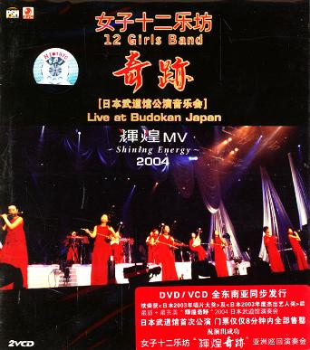
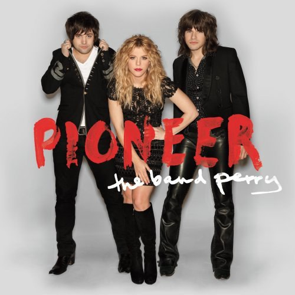

# 前言

## 关于音乐承载形式的偏好

音乐一直传唱到现在，承载形式时代分别从

> 胶片时代——磁带时代——**CD**时代——**MP3**时代（但我喜欢称为下载时代）——流媒体时代（如今）

而我从记忆开始就已经在 CD 时代中接触音乐，而主动去收集则是到 MP3 时代，

可能那个时候的人无形之中养成了一种类似于松鼠囤积松果的思维，

即只有将物件真正的收集到手中，才真正属于我的。

CD，则刚好满足这样的内心需求。

而且当时的 CD 除了承载听觉的任务，包括专辑封面，包括内含的歌词本，

则是在听觉享受的基础上，带来视觉上的享受和巧思。 

## 关于对音乐的敏感和记忆烙印

虽然我比较亲近的朋友，应该多多少少也挺多听过我分享为什么我对千禧年代的歌有着情有独钟……甚至是执着的亲近，

但基于现在还是想再重复一下其中的缘由。

### 一

*歌名：川の流れのように（如川河的流水般）*

<link rel="stylesheet" href="/dist/APlayer.min.css">

记得自己幼儿园的时候，先是自己的父亲喜欢听歌，尤其听得最多的是当时的**女子十二乐坊**；

可能大家没听说过这一个古典乐器演奏组合，这里我摘录下百度百科的介绍：

> 女子十二乐坊（Twelve Girls Band）是由王晓京与友人于2001年6月18日联合创立的中国新民乐组合，现隶属于北京世纪星碟文化传播有限公司，成员由中央音乐学院等院校选拔组成，使用古筝、琵琶等传统乐器演奏现代音乐 。乐团于2001年10月在北京举办首场《魅力》音乐会，次年登上央视春晚。2003年在日本发行的首张专辑《女子十二乐坊》销量突破200万张，获日本唱片大奖及杰出海外艺人奖。2004年在美国发行的《东方动力》专辑蝉联公告牌国际榜冠军11周 。

其实也不能指望一个小孩子对于音乐有着什么鉴赏，但基于模仿和习惯，加上自己父亲一周总会大概有四五天，回家便打开 CD 影碟机来听歌，

所以也是小的时候听着并不太古典的古典纯音乐，某种程度上磨耳朵，也是无意之间培养对古典纯音乐*（或者说无歌词音乐的适应和鉴赏）*，或者说在我视角里，纯音乐也像一位歌手用旋律唱着歌词。

而我直到现在最喜欢的这个乐团组合的专辑，则是2004年在日本武道馆演出的录制专辑（B站也有up提取出该专辑音轨 BV1ts411U7t3）

<iframe src="//player.bilibili.com/player.html?isOutside=true&aid=2417686&bvid=BV1ts411U7t3&cid=3783510&p=1&autoplay=0" scrolling="no" border="0" frameborder="no" framespacing="0" allowfullscreen="true"></iframe>

*（写着写着已经想去闲鱼上面收这张专辑了）*

### 二

还有影响比较大的，可能就是家楼下开着的 CD 店铺了。

站在现在的视角，毕竟千禧年代是唱片时代，基本上发行歌曲是通过线下唱片店进行宣传和销售，

所以当时甚至是还未上幼儿园的儿童时期，尤其是在夜深人静的晚上，大概晚上九点钟就要上床睡觉，但偶尔总会精神抖擞，

这个时候伴我入眠的并非摇篮曲，而是楼下 CD 唱片播放的当下最热门的流行金曲，华语偏多，欧美也有。

大概听了快到小学三四年级后，音乐的销售渠道逐步从线下转移到线上的下载时代，唱片店播放的歌曲才不那么丰富了。

*（当然直到2025年，楼下唱片店还在，但更多是放一些不知名歌手翻唱的歌曲，售卖的也从传统专辑唱片变成车载音乐）**sad*

所以像现在如果音乐广播随机播放歌曲的时候，一旦出现我耳朵听起来十分顺耳的歌，

当我心情激动听歌识曲，打开专辑一看，基本上总会在1995——2010年这段区间的歌曲。

说起来也奇怪，我也纳闷为什么似乎一下子能辨认出千禧年的音乐风格，

当然我也不懂乐理，可能是当时流行的旋律组合、调音处理或者是和弦演奏有着独属于千禧年代的风格特点，

才容易被我这么一下子识别并收藏下来。

### 三

还有一部分影响因素，可能就是自己表姐的影响了，

小学阶段很喜欢去我表姐那边做客，一方面有书可以看，无论是课外书还是她的课本，总是照看不误，

而等到我小学毕业的时候，也可能是为了避免学习材料的浪费，

当时表姐送了我两套听力材料，具体是哪个牌子的忘了，有磁带，也有配套的英语杂志样的书籍，

出于好奇，有空我也会把磁带放到播放机里，除了当成锻炼听力的英语材料之外，更多期待的也是期间出现的音乐分享板块，

顺带的，当时听歌对我而言是一个主动寻找的过程，家里人也出于提升英语的目的，给我一个建议，

说是去多听听英语歌曲。

而当时我也想着随便搜搜，看到榜单英语区前面的就随机听听，

这个时候就出现了影响我欧美音乐的乐队组合—— The Band Perry ，现在想想，应该是他们的 If I Die Young 霸榜的时期，

所以乡村音乐这一个板块对我的欧美音乐而言又占据了十分重要的地位。

当然说到这里，自然想说到个人认为其组合最好听的二专—— Pioneer 

而个人最喜欢该专辑里的一首歌 *Don’t Let Me Be Lonely*

<link rel="stylesheet" href="/dist/APlayer.min.css">

其中经典的乡村乐器组合加上姐姐主唱 Kimberly Perry 的嗓音，简直是奠定我对乡村音乐的主要印象。

而以上三点，可以说是把我拐到将音乐的地位放的如此重要，以及奠定我偏爱的音乐风格的主要原因了。

后续再继续更新现有 CD 架上对我而言有着独特感受的专辑。 :)
